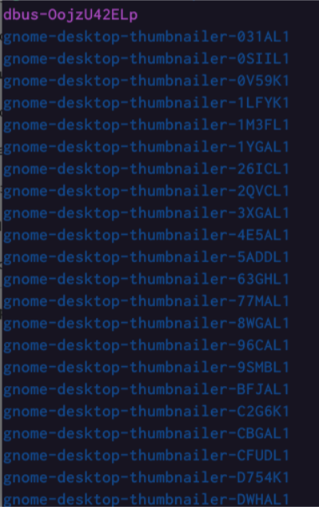
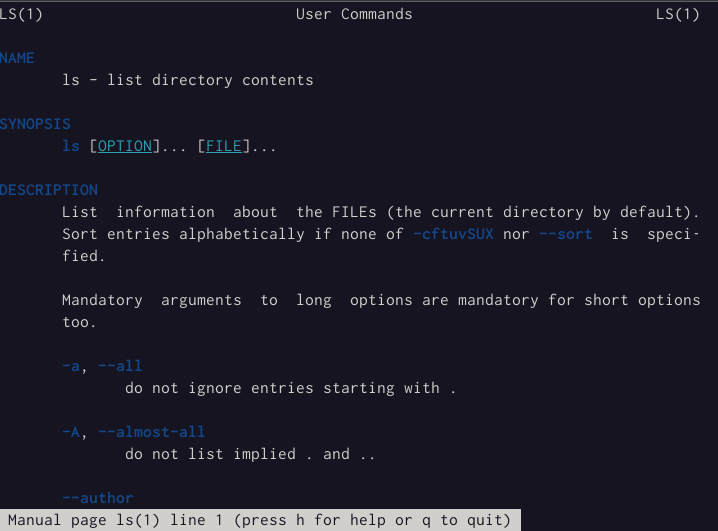
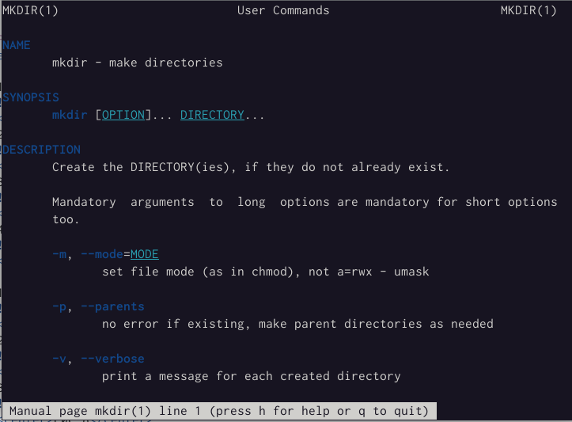
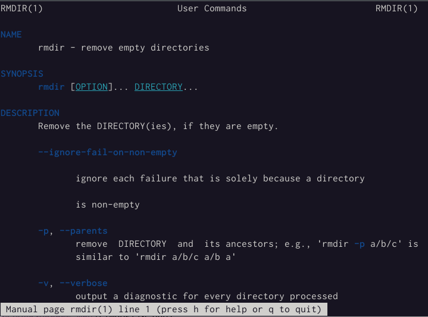

---
# Front matter
lang: ru-RU
title: "Лабораторная работа №4"
subtitle: "Дисциплина: Операционные системы"
author: "Иван Подоляк"

# Formatting
toc-title: "Содержание"
toc: true # Table of contents
toc_depth: 2
lof: true # List of figures
lot: true # List of tables
fontsize: 12pt
linestretch: 1.5
papersize: a4paper
documentclass: scrreprt
polyglossia-lang: russian
polyglossia-otherlangs: english
mainfont: PT Serif
romanfont: PT Serif
sansfont: PT Sans
monofont: PT Mono
mainfontoptions: Ligatures=TeX
romanfontoptions: Ligatures=TeX
sansfontoptions: Ligatures=TeX,Scale=MatchLowercase
monofontoptions: Scale=MatchLowercase
indent: true
pdf-engine: lualatex
header-includes:
  - \linepenalty=10 # the penalty added to the badness of each line within a paragraph (no associated penalty node) Increasing the value makes tex try to have fewer lines in the paragraph.
  - \interlinepenalty=0 # value of the penalty (node) added after each line of a paragraph.
  - \hyphenpenalty=50 # the penalty for line breaking at an automatically inserted hyphen
  - \exhyphenpenalty=50 # the penalty for line breaking at an explicit hyphen
  - \binoppenalty=700 # the penalty for breaking a line at a binary operator
  - \relpenalty=500 # the penalty for breaking a line at a relation
  - \clubpenalty=150 # extra penalty for breaking after first line of a paragraph
  - \widowpenalty=150 # extra penalty for breaking before last line of a paragraph
  - \displaywidowpenalty=50 # extra penalty for breaking before last line before a display math
  - \brokenpenalty=100 # extra penalty for page breaking after a hyphenated line
  - \predisplaypenalty=10000 # penalty for breaking before a display
  - \postdisplaypenalty=0 # penalty for breaking after a display
  - \floatingpenalty = 20000 # penalty for splitting an insertion (can only be split footnote in standard LaTeX)
  - \raggedbottom # or \flushbottom
  - \usepackage{float} # keep figures where there are in the text
  - \floatplacement{figure}{H} # keep figures where there are in the text
---

# Цель работы

Приобретение практических навыков взаимодействия пользователя с системой посредством командной строки

# Ход выполнения работы 

1. Первым делом необходимо узнать домашний каталог с помощью команды pwg

Рис 1

2. Далее необходимо выполнить сразу несколько действий:
  1) Перейти в каталог tmp
  
  
Рис 2

  2) Узнать содержимое каталога
  
  
Рис 3

  3) Узнать есть ли файл cron в каталоге var/spool
  
  
Рис 4

  4) Необходимо узнать подробную информацию о файлах
  
  
Рис 5

3. Следующим шагом будет опять цепочка действий
  1) Создать каталог newdir
  
  
Рис 6

  2) Создать внутри еще один каталог
  
  
Рис 7

  3) Создаем много каталогов и удаляем их одной командой.
  
  
Рис 8

  4) Удаляем каталог newdir
  
  
Рис 9

4. Узнаем что за команда ls с помощью man

Рис 10

5. Набор команд ls

Рис 11

6. Далее необходимо узнать подробнее о командах cd, pwd, mkdir, rmdir, rm

Рис 12

Рис 13

Рис 14

Рис 15

Рис 16

7. Модификация команды через history

Рис 17

# Вывод

Я научился некторым командам и особенно удивился команде history, которая может сократиить время работы ползователя над длительным проектом.

# Констрольные вопросы 

1). Командная строка – специальная программа, позволяющая управлять операционной системой при помощи текстовых команд, вводимых в окне приложения. 
2). Для определения абсолютного пути к текущему каталогу используется команда pwd (print working directory). Например, команда «pwd» в моем домашнем каталоге выведет: /home/tbkonovalova 
3). Команда «ls-F» (или «ls-aF», тогда появятся еще скрытые файлы) выведет имена файлов в текущем каталоге и их типы. Тип каталога обозначается /, тип исполняемого файла обозначается , тип ссылки обозначается @. Пример на Рисунке 2. 
4). Имена скрытых файлов начинаются с точки. Эти файлы в операционной системе скрыты от просмотра и обычно используются для настройки рабочей среды. Для того, чтобы отобразить имена скрытых файлов, необходимо использовать команду «ls –a». Пример на Рисунке 2. 
5). Команда rm используется для удаления файлов и/или каталогов. Команда rm-i выдает запрос подтверждения наудаление файла. Команда rm-r необходима, чтобы удалить каталог, содержащий файлы. Без указания этой опции команда не будет выполняться. Если каталог пуст, то можно воспользоваться командой rmdir. Если удаляемый каталог содержит файлы, то команда не будет выполнена –нужно использовать «rm -r имя_каталога».Таким образом, каталог, не содержащий файлов, можно удалить и командой rm, и командой rmdir. Файл командой rmdir удалить нельзя. Примеры на Рисунке 9. 
6). Чтобы определить, какие команды выполнил пользователь в сеансе работы, необходимо воспользоваться командой «history». 7). Чтобы исправить илизапустить на выполнение команду, которую пользователь уже использовал в сеансе работы, необходимо: в первом случае:воспользоваться конструкцией !:s//, во втором случае: !. Примеры на Рисунке 21. 
8). Чтобы записать в одной строке несколько команд, необходимо между ними поставить ; . Например, «cd /tmp; ls». 
9). Символ обратного слэша позволяет использовать управляющие символы (“.”, “/”, “$”, "“,”[“,”]“,”^“,”&“) без их интерпретации командной оболочкой; процедура добавления данного символа перед управляющими символами называетсяэкранированием символов. Например, команда «lsnewdir/morefun» отобразит содержимое каталога newdir/morefun. 10). Команда «ls -l» отображает список каталогов и файлов с подробной информацией о них (тип файла, право доступа, число ссылок, владелец, размер, дата последней ревизии, имя файла или каталога). 11). Полный, абсолютный путь от корня файловой системы –этот путь начинается от корня”/" и описывает весь путь к файлуили каталогу; Относительный путь – это путь к файлу относительно текущего каталога(каталога, где находится пользователь). Например, «cd/newdir/morefun» – абсолютный путь, «cdnewdir» – относительный путь. 12). Чтобы получить необходимую информацию о команде, необходимо воспользоваться конструкцией man[имя_команды], либо использовать опцию help, которая предусмотрена для некоторых команд. 13). Для автоматического дополнения вводимых команд служит клавиша Tab.

